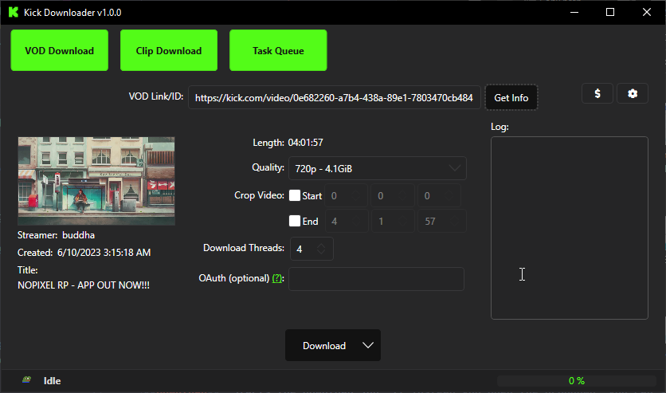

# Kick Vod Downloader

# This is a fork of the lay295/TwitchDownloader

About: 

To overcome the Bot protection I attempted to use cookies copied from the first request in subsequent requests. However, I encountered difficulties in making TLS and Fingerprinting work, both in C# and Golang. Despite Golang offering advanced features for this purpose, I was unable to bypass the bot protection using cookies alone.

To tackle this problem, I utilized Puppeteer chromium headless mode, meaning the requests take more time than it should.

If Kick introduces proper API support in the future, this repository will be updated accordingly.

## Latest Alpha
- Download VODs
- Download Clips


Preview:
- 


Since kick doesnt save chats, no chat feature will be available.

## Build Instructions
Windows only for now...
GUI

1. Clone the repository:
```
git clone https://github.com/siuramka/KickDownloader.git
```
2. Navigate to the solution folder:
```
cd KickDownloader
```
3. Restore the solution:
```
dotnet restore
```
4. Build the GUI:
```
dotnet publish KickDownloaderWPF -p:PublishProfile=Windows -p:DebugType=None -p:DebugSymbols=false
```
5. a) Navigate to the GUI build folder:
```
cd KickDownloaderWPF/bin/Release/net6.0-windows/publish/win-x64
```


Credits go to lay295 and collaborators for the TwitchDownloader code.
